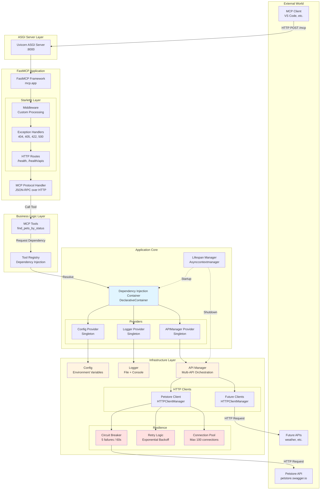
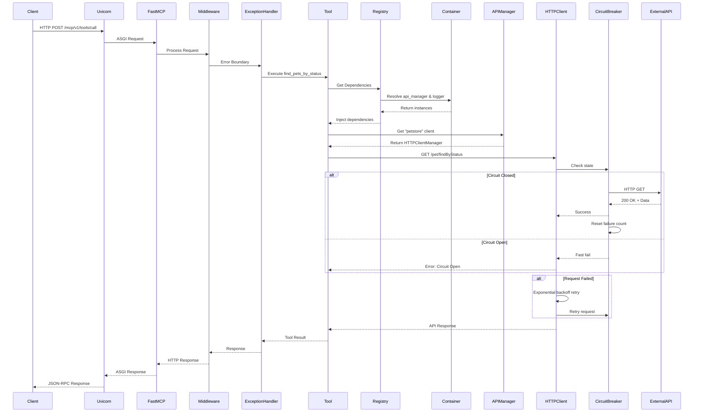
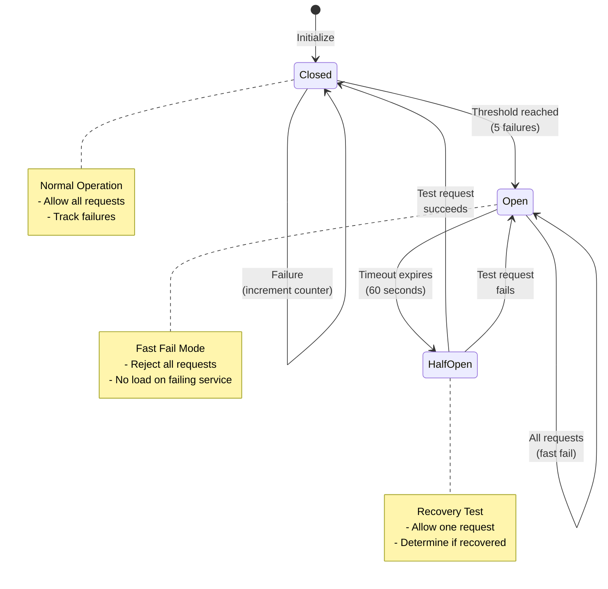
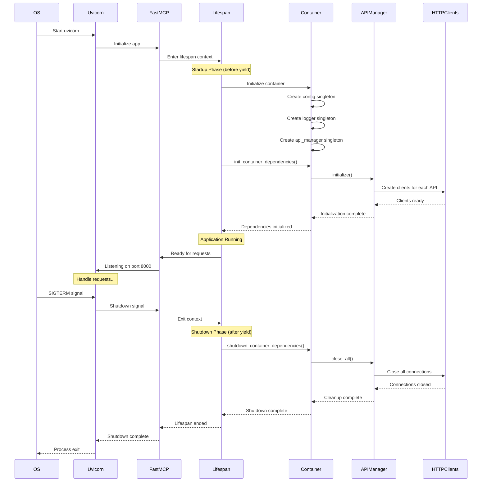
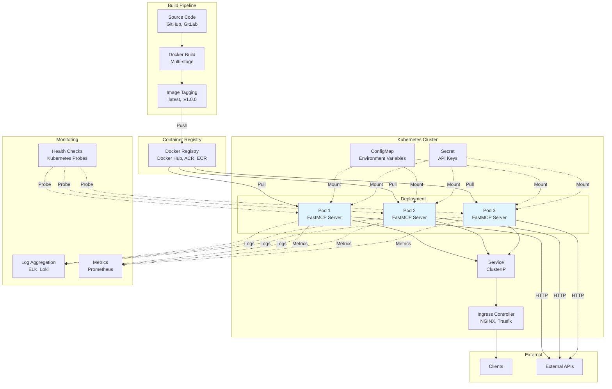

# FastMCP Server - Architecture Diagrams

This document contains all visual architecture diagrams for the FastMCP Server project.

---

## 1. System Architecture Diagram

Shows the complete layered architecture from clients through the ASGI server, FastMCP framework, dependency injection container, and down to the infrastructure layer with HTTP clients and resilience patterns.

**Key Features**:
- Clean layered architecture (Server → Application → Core → Business Logic → Infrastructure)
- Color-coded components (Blue: Container, Yellow: Config/Logger/APIManager, Red: Resilience)
- Complete dependency flow from external APIs through to clients
- Lifecycle management integration

---

## 2. Request Flow - Tool Call Lifecycle

Sequence diagram showing the complete flow of a tool request from client through all layers and back.

**Key Features**:
- Step-by-step request handling from client to external API
- Dependency injection resolution shown explicitly
- Circuit breaker decision logic (Circuit Closed vs Open)
- Retry mechanism with exponential backoff
- Complete response chain back to client

---

## 3. Circuit Breaker State Machine

State diagram showing the 3-state circuit breaker pattern for protection against cascading failures.

**Key Features**:
- **CLOSED State**: Normal operation, track failures, reset on success
- **OPEN State**: Fast-fail after 5 consecutive failures, prevent cascading
- **HALF_OPEN State**: Test recovery after 60-second timeout
- Automatic recovery detection and state transitions

---

## 4. Application Lifecycle - Startup & Shutdown

Detailed sequence diagram showing the complete application lifecycle from startup through running to graceful shutdown.

**Key Features**:
- **Startup Phase**: Container initialization, singleton creation, API client setup
- **Running Phase**: Request handling with initialized dependencies
- **Shutdown Phase**: Graceful cleanup, connection closure, resource release
- ASGI lifespan context manager pattern shown explicitly

---

## 5. Kubernetes Deployment Architecture

Complete deployment architecture showing containerization, orchestration, and monitoring integration.

**Key Features**:
- Build pipeline from source to container registry
- Kubernetes deployment with 3 replicas for high availability
- ConfigMap and Secret injection into pods
- Service and Ingress for load balancing
- External API connectivity
- Monitoring integration (logs, metrics, health checks)
- Dashed lines showing configuration/monitoring injection

---

## Diagram Legend

### Colors & Styling

| Color | Meaning | Components |
|-------|---------|-----------|
| **Light Blue** | Dependency Injection | Container, Providers |
| **Light Yellow** | Configuration | Config, Logger, APIManager |
| **Light Red** | Resilience Patterns | Circuit Breaker, Retry Logic, Connection Pool |
| **Cyan** | Application Pods | FastMCP Server instances |

### Line Types

| Line Type | Meaning |
|-----------|---------|
| **Solid Arrow** | Direct dependency/flow |
| **Dashed Arrow** | Configuration/monitoring injection |
| **Bidirectional** | Two-way communication |

---

## How to Use These Diagrams

### For Documentation
1. **System Architecture**: Use as overview in README or architecture docs
2. **Request Flow**: Use to explain how requests are processed
3. **Circuit Breaker**: Use to explain resilience patterns
4. **Lifecycle**: Use to explain startup/shutdown behavior
5. **Deployment**: Use for DevOps and infrastructure documentation

### For Presentations
- Copy diagram code into Mermaid Live Editor (https://mermaid.live)
- Export as PNG/SVG for slides
- Use in architecture review meetings

### For Team Communication
- Share this file with team members
- Reference specific diagrams in pull request descriptions
- Use in architecture decision records (ADRs)

### For Implementation Reference
- Refer to diagrams when adding new features
- Ensure new components follow the layered architecture
- Use dependency flow to understand injection points

---

## Diagram Updates

When the architecture changes:

1. **System Architecture**: Update when adding new layers or major components
2. **Request Flow**: Update when changing tool execution pipeline
3. **Circuit Breaker**: Update if changing failure thresholds/timeouts
4. **Lifecycle**: Update if changing startup/shutdown behavior
5. **Deployment**: Update when changing infrastructure strategy

---

## Related Documentation

- [QUICK_START_GUIDE.md](QUICK_START_GUIDE.md) - Setup and usage guide
- [PRODUCTION_REVIEW.md](PRODUCTION_REVIEW.md) - Architecture and design review
- [TECHNICAL_ARCHITECTURE.md](TECHNICAL_ARCHITECTURE.md) - Detailed technical documentation

---

**Last Updated**: March 2, 2026  
**FastMCP Version**: 3.0.2  
**Python Version**: 3.11+
